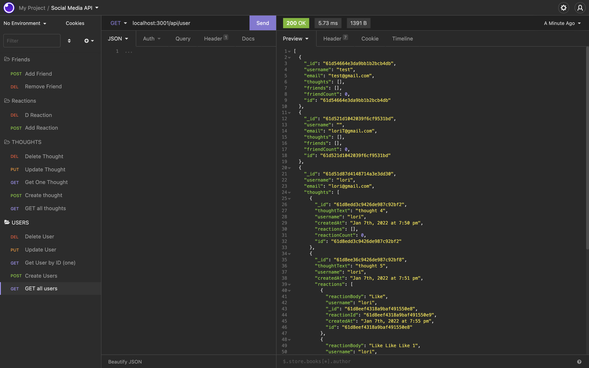
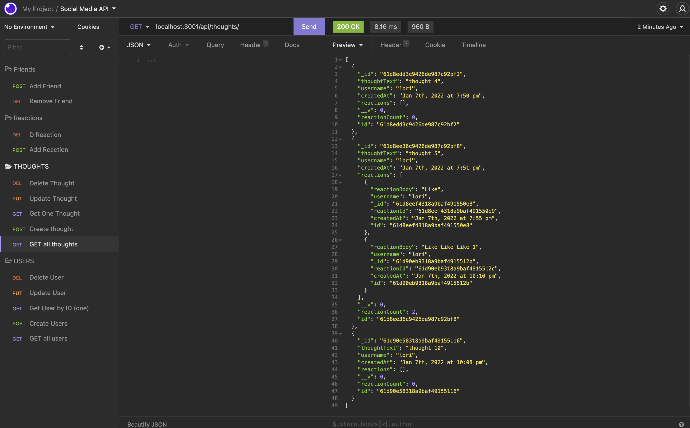

# 18---homework - Lori Timmons 

## Description
This is a API for a social networking application. Users can make profiles, add friends, post thoughts. Friends can then add their reactions. This application is created using Express, MongoDB, and Mongoose. 

## Installation
In the project run an npm i to install dependencies. Then run an npm start to start the server. Now you can use postman / insomnia to see the routes. 

## Video
https://watch.screencastify.com/v/YWtLVV32fdNuq6MnW6lw

## Contact Me
 
 Email: lorietimmons@gmail.com 
 GitHub: LoriTimmons  
 GitHub Repo: https://github.com/LoriTimmons/18-homework 
 Video: https://watch.screencastify.com/v/YWtLVV32fdNuq6MnW6lw
 